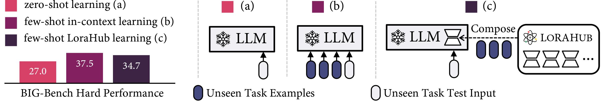
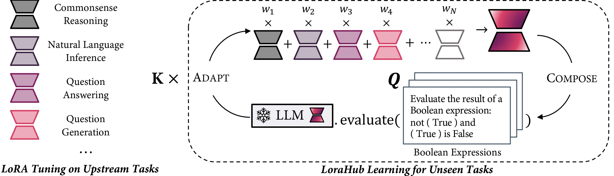

# LoraHub: Efficient Cross-Task Generalization via Dynamic LoRA Composition

The official repository which contains the code and pre-trained models for our paper [LoraHub: Efficient Cross-Task Generalization via Dynamic LoRA Composition](https://arxiv.org/abs/2307.13269).


# 🔥 Updates
- [**2023-8-3**]: Integrated into Replicate, check out the [demo](https://replicate.com/cjwbw/lorahub)!
- [**2023-7-27**]: We released our [code](https://github.com/sail-sg/lorahub) and [demo](https://huggingface.co/spaces/sail/lorahub). Check it out!
- [**2023-7-26**]: We released our [paper](https://arxiv.org/abs/2307.13269).


# 🏴󠁶󠁵󠁭󠁡󠁰󠁿 Overview

Low-rank adaptations (LoRA) are techniques for fine-tuning large language models on new tasks. We propose **LoraHub**, a framework that allows **composing multiple LoRA modules** trained on different tasks. The goal is to achieve good performance on **unseen tasks** using just a few examples, **without needing extra parameters or training**. And we want to build a marketplace where users can share their trained LoRA modules, thereby facilitating the application of these modules to new tasks.

<figure style="text-align:center">
  
</figure>

The figure demostrates the zero-shot learning, few-shot in-context learning and few-shot lorahub learning (ours). Note that the Compose procedure is conducted per task rather than per example. Our method achieves similar inference throughput as zero-shot learning, yet approaches the performance of in-context learning on the BIG-Bench Hard (BBH) benchmark. The experimental results show the superior efficacy of our method in comparison to zero-shot learning while closely resembling the performance of in-context learning (ICL) in few-shot scenarios.

<br>

<figure style="text-align:center">
  
</figure>

The figure shows the pipeline of LoraHub Learning. Our method encompasses two stages: the <strong>Compose</strong> stage and the <strong>Adapt</strong> stage. During the Compose stage, existing LoRA modules are integrated into one unified module, employing a set of weights, denoted as <em>w</em>, as coefficients. In the Adapt stage, the amalgamated LoRA module is evaluated on a few examples from the unseen task. Subsequently, a <strong>gradient-free algorithm</strong> is applied to refine <em>w</em>. After executing <em>K</em> iterations, a <strong>highly adapted LoRA module</strong> is produced, which can be incorporated with the LLM to perform the intended task.

<br>


# 🌲 Project Structure

Our code is organized as below:
``` shell
|-- lorahub
    -- algorithm.py # main code for lorahub learning and inference
    -- constant.py # lora candidate module names
|-- example.py # usage code for demonstration purpose
```

And you can use LoraHub learning by simply calling the following function:

``` python
from lorahub.algorithm import lorahub_learning

lorahub_learning(lora_module_list: List[str], # list of lora candidates
                 example_inputs: List[str],
                 example_outputs: List[str],
                 max_inference_step: int, 
                 model_name_or_path=None, # if not given, we will use the model_name_or_path in lora config
                 batch_size=None, 
                 get_loss=default_get_loss, # The function to get the objective for optimiztion, use loss as default (can be changed to something like acc. or similarity)
                 get_regular=default_l1_regularization,  # The function to get regularization term for the weight, use 0.05*|w_i| as default
                 seed=42)
```


# ⚡️ Quickstart

## Prepare Environment

First, you should run the following commands to install the latest lib developed for LoraHub.

```python
pip install datasets
pip install transformers
pip install peft
pip install nevergrad
pip install torch
pip install tqdm
pip install pandas
pip install numpy
```

## Install LoraHub

The pypi package will be released in a few days. Please stay tuned!

# 🏰 Resource

## LoRA Candidates

Our methodology requires a compendium of LoRA modules trained on preceding tasks. For parity with Flan, we adopt the tasks utilized to instruct Flan-T5, thereby incorporating nearly 196 distinct tasks and their corresponding instructions via https://huggingface.co/datasets/conceptofmind/FLAN_2022. Following this, we created several LoRA modules as possible candidates. These LoRA modules can be accessed at https://huggingface.co/models?search=lorahub.

# 💬 Citation

If our work is useful for you, please consider citing our paper:

```bibtex
@misc{huang2023lorahub,
    title={LoraHub: Efficient Cross-Task Generalization via Dynamic LoRA Composition}, 
    author={Chengsong Huang and Qian Liu and Bill Yuchen Lin and Tianyu Pang and Chao Du and Min Lin},
    year={2023},
    eprint={2307.13269},
    archivePrefix={arXiv},
    primaryClass={cs.CL}
}
```
